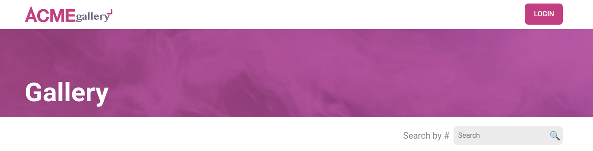

# ACME gallery. React challenge.




## Installation

```
// clone repo (gh CLI)
gh repo clone norbix14/acme-gallery acme

// clone repo (git clone)
git clone https://github.com/norbix14/acme-gallery.git acme

// next steps
cd acme

// install dependencies
npm i

// run app (vite)
npm run dev

// build
npm run build
serve -s -l 4000 dist/
```
